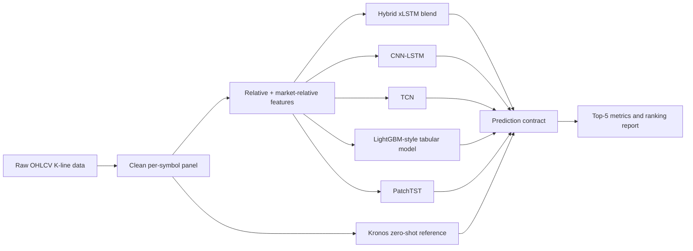
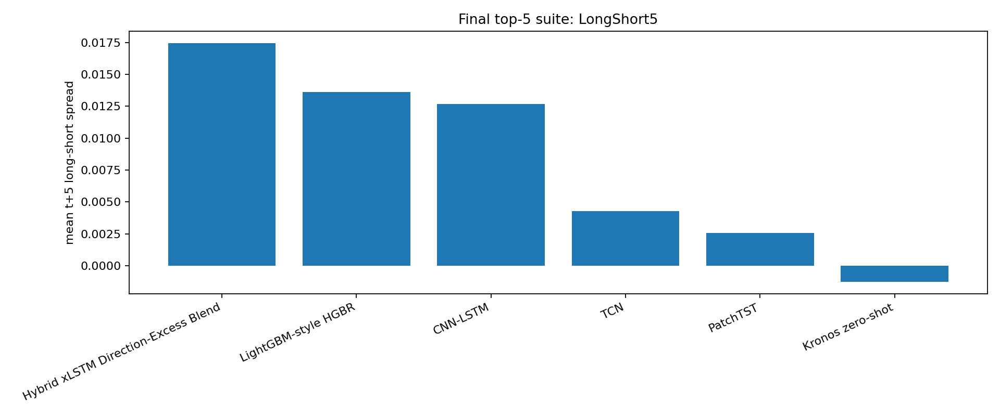

# VN Stock Prediction

<h3 align="center">
  <b>Final Top-5 Stock-Selection Suite for 95-Symbol K-Line Data</b><br>
  <i>Hybrid xLSTM Direction-Excess Blend · CNN-LSTM · TCN · LightGBM-style · PatchTST · Kronos reference</i>
</h3>

<p align="center">
  <a href="https://www.python.org/"></a>
  
  
  
</p>

---

## Abstract

This repository implements a leakage-safe K-line forecasting pipeline for 5-session stock selection. The final selected model is now named **Hybrid xLSTM Direction-Excess Blend**. It replaces the previous informal `BestF6-v2` name.

Main target:

```text
target_ret_5d = close[t+5] / close[t] - 1
```

The final benchmark removes iTransformer and compares:

- Hybrid xLSTM Direction-Excess Blend
- CNN-LSTM
- TCN
- LightGBM-style tabular gradient boosting
- PatchTST
- Kronos zero-shot reference, not retrained

---

## Final Architecture



Hybrid xLSTM score:

```text
final_score =
    0.6 * normalized(return/ranking signal)
  + 0.2 * normalized(direction signal)
  + 0.2 * normalized(excess/market-relative signal)
```

Prediction contract:

```text
model_family, model_version, symbol, date, split,
y_true, y_pred, target_name, horizon, run_id
```

---

## Final Top-5 Model Suite

| Model | Scope | Rows | IC | RankIC | Direction Acc | Balanced Acc | Top5 Return | LongShort5 | Top5 Acc |
| --- | --- | ---: | ---: | ---: | ---: | ---: | ---: | ---: | ---: |
| Hybrid xLSTM Direction-Excess Blend | full test | 29,535 | 0.0904 | 0.0852 | 52.65% | 52.41% | 1.7120% | 1.7462% | 58.53% |
| LightGBM-style HGBR | full test | 29,535 | 0.0545 | 0.0379 | 50.53% | 49.89% | 1.2315% | 1.3634% | 55.41% |
| CNN-LSTM | full test | 29,535 | 0.0522 | 0.0433 | 51.80% | 50.32% | 1.2969% | 1.2686% | 56.70% |
| TCN | full test | 29,535 | 0.0212 | 0.0216 | 48.91% | 48.89% | 0.7223% | 0.4266% | 54.68% |
| PatchTST | full test | 29,535 | 0.0185 | 0.0150 | 48.58% | 49.06% | 0.6983% | 0.2568% | 52.78% |
| Kronos zero-shot | partial full-test | 18,978 | 0.0069 | 0.0189 | 50.95% | 51.08% | 0.3581% | -0.1264% | 52.42% |

Kronos is listed as a reference only. The current full-test Kronos run stopped at `61/95` symbols, so the row is not directly comparable with full 95-symbol models yet.

Decision:

- Hybrid xLSTM Direction-Excess Blend remains the production candidate.
- Architecture A1 `Multi-Head LongOnlyRank` was tested and not promoted because it reduced IC, RankIC, Top5 Return, Top5 hit-rate, and long-only total return versus the Hybrid baseline.
- LightGBM-style HGBR is the strongest non-deep baseline by LongShort5.
- CNN-LSTM is competitive and has the second-best Top5 Direction Accuracy among trainable full-test models.
- TCN and PatchTST are weaker in this run.
- Kronos should only be judged after a completed 95-symbol historical zero-shot run.

---

## Visualizations

<p align="center">
  
</p>

---

## Key Artifacts

| Artifact | Path |
| --- | --- |
| Hybrid xLSTM final predictions | `outputs/final/hybrid_xlstm_direction_excess_blend_predictions.parquet` |
| Final suite predictions | `outputs/final/model_suite_top5/` |
| Final suite metrics | `outputs/reports/final_top5_model_suite/top5_model_suite_metrics.csv` |
| Final suite report | `outputs/reports/final_top5_model_suite/top5_model_suite_report.md` |
| Final suite figure | `outputs/figures/final_top5_model_suite/top5_model_suite_longshort.png` |
| Architecture ablation report | `outputs/reports/architecture_ablation_longonly/architecture_ablation_report.md` |
| Final model architecture note | `docs/final_model_architecture_and_principles.md` |
| Legacy final model note | `docs/best_f6_v2_direction_blend.md` |

---

## Reproduce Final Suite

### Environment

```powershell
python -m venv .venv
.venv\Scripts\Activate.ps1
pip install -r requirements.txt
$env:PYTHONPATH='src'
```

### Rebuild Shared Dataset

```powershell
python -m vnstock.pipelines.run_build_shared_dataset --config configs/data/dataset_daily.yaml --use-interim
```

### Run Final Top-5 Suite

```powershell
python scripts\run_final_top5_model_suite.py
```

This trains/inferes CNN-LSTM, TCN, LightGBM-style HGBR, and PatchTST, then compares them with the Hybrid xLSTM blend and the available Kronos reference.

### Run Architecture Ablation A1

```powershell
python scripts\run_architecture_ablation_longonly.py
```

This tests `Hybrid xLSTM Multi-Head LongOnlyRank` against the Hybrid baseline on the same locked test rows.

### Kronos Full-Test Reference

Kronos is intentionally not retrained. For historical zero-shot inference:

```powershell
python scripts\run_kronos_full_test.py
python scripts\compute_kronos_full_metrics.py
```

On CPU, this is slow because it forecasts each historical window.

### Run Tests

```powershell
python -m pytest tests -q
```

---

## Repository Structure

```text
vn-stock-prediction/
├── configs/                  # Dataset, model, and experiment configs
├── data/                     # Raw, interim, and processed K-line data
├── docs/                     # Data contract, model notes, final model note
├── outputs/                  # Final top-5 reports, figures, and predictions
├── registry/                 # Model checkpoints and manifests
├── scripts/                  # Final evaluation scripts
├── src/vnstock/              # Data, models, metrics, and pipeline code
└── tests/                    # Leakage, target, metric, and pipeline tests
```
