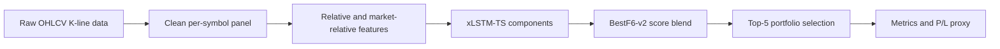
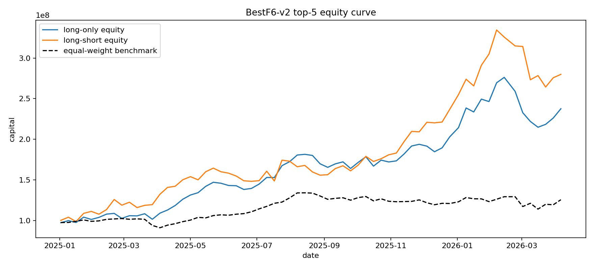
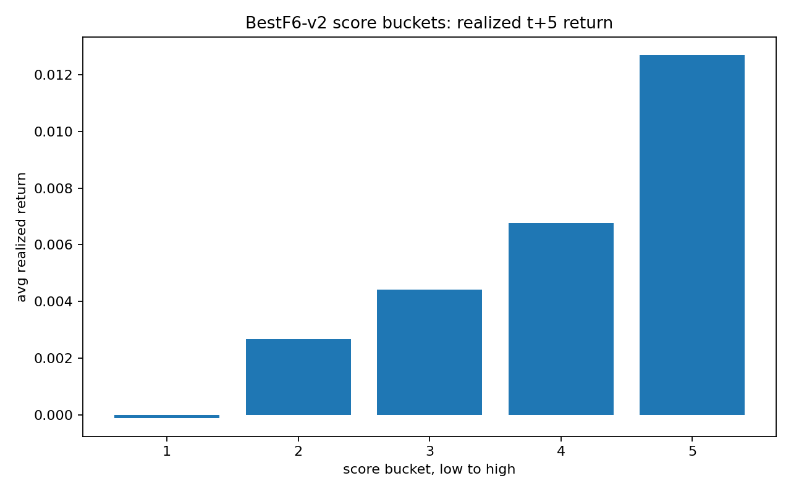
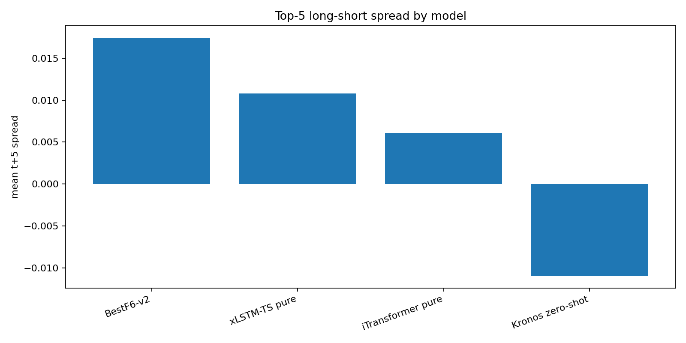

# VN Stock Prediction

<h3 align="center">
  <b>BestF6-v2 Top-5 Stock Selection for 95-Symbol K-Line Data</b><br>
  <i>xLSTM-based return, direction, and market-relative blend for 5-session stock ranking</i>
</h3>

<p align="center">
  <a href="https://www.python.org/"></a>
  
  
  
</p>

---

## Abstract

This repository implements a leakage-safe K-line forecasting pipeline for stock selection. The final kept architecture is **BestF6-v2 top-5**, a 5-session return-ranking model that blends return, direction, and market-relative/excess-return signals.

Main target:

```text
target_ret_5d = close[t+5] / close[t] - 1
```

The final decision metric is not raw price forecasting. The project optimizes stock-selection quality: `IC`, `RankIC`, `Top5 Return`, `LongShort5`, and out-of-time investment P/L proxy.

---

## Final Architecture



Final score:

```text
final_score =
    0.6 * normalized(return/ranking signal)
  + 0.2 * normalized(direction signal)
  + 0.2 * normalized(excess/market-relative signal)
```

Prediction contract:

```text
model_family, model_version, symbol, date, split,
y_true, y_pred, target_name, horizon, run_id
```

---

## Final Top-5 Metrics

| Model | Scope | Rows | IC | RankIC | Direction Acc | Balanced Acc | Top5 Return | LongShort5 | Top5 Acc |
| --- | --- | ---: | ---: | ---: | ---: | ---: | ---: | ---: | ---: |
| BestF6-v2 | full test | 29,535 | 0.0904 | 0.0852 | 52.65% | 52.41% | 1.7120% | 1.7462% | 58.53% |
| xLSTM-TS pure | full test | 29,535 | 0.0588 | 0.0507 | 53.61% | 53.09% | 1.3769% | 1.0794% | 55.17% |
| iTransformer pure | full test | 29,535 | 0.0198 | 0.0047 | 50.85% | 50.61% | 1.0674% | 0.6089% | 53.94% |
| Kronos zero-shot | latest only | 95 | 0.0497 | 0.1152 | 61.05% | 67.72% | 6.1400% | -1.0972% | 100.00% |

Kronos is latest-only in the current adapter, so it is a point-in-time reference instead of a full historical benchmark.

Decision:

- BestF6-v2 is kept because it wins IC, RankIC, Top5 Return and LongShort5 on full test.
- xLSTM-TS pure has higher raw Direction Accuracy, but weaker stock-ranking performance.
- iTransformer is weaker in this run.
- Kronos needs historical zero-shot inference before direct production comparison.

---

## Investment P/L Proxy

Settings:

- Test split only.
- Top 5 stocks selected by `BestF6-v2` score.
- Rebalance every 5 sessions.
- Initial capital: `100,000,000`.
- Transaction cost: `15 bps`.

| Mode | Final Capital | Profit | Total Return | Benchmark Return | Excess Profit | Sharpe Proxy | Hit Rate | Max Drawdown |
| --- | ---: | ---: | ---: | ---: | ---: | ---: | ---: | ---: |
| Long-only top-5 | 237,617,999 | 137,617,999 | 137.62% | 25.53% | 112,089,411 | 2.2826 | 62.12% | -22.25% |
| Long-short top/bottom-5 | 279,937,889 | 179,937,889 | 179.94% | 25.53% | 154,409,300 | 2.2940 | 62.12% | -21.00% |

This is a research proxy from realized `target_ret_5d`, not a broker-level simulation. It does not include order book depth, intraday execution, taxes, lot size, suspended trading, or detailed slippage.

---

## Visualizations

<p align="center">
  
</p>

<p align="center">
  
  
</p>

Score buckets on test:

| Score Bucket | Avg Realized t+5 Return | Direction Acc |
| --- | ---: | ---: |
| Lowest 20% | -0.0120% | 47.05% |
| 2 | 0.2666% | 50.13% |
| 3 | 0.4422% | 52.03% |
| 4 | 0.6771% | 54.50% |
| Highest 20% | 1.2697% | 57.06% |

The monotonic bucket pattern is the clearest evidence for positive IC: higher scores realize higher future returns.

---

## Key Artifacts

| Artifact | Path |
| --- | --- |
| Final predictions | `outputs/final/best_f6_v2_predictions.parquet` |
| Model comparison predictions | `outputs/final/model_compare_top5/` |
| Top-5 final report | `outputs/reports/best_f6_v2_top5/best_f6_v2_top5_report.md` |
| Top-5 P/L summary | `outputs/reports/best_f6_v2_top5/best_f6_v2_top5_summary.csv` |
| Top-5 model comparison | `outputs/reports/best_f6_v2_top5/best_f6_v2_top5_model_compare.csv` |
| Top-5 trade log | `outputs/reports/best_f6_v2_top5/best_f6_v2_top5_trades.csv` |
| Equity curve CSV | `outputs/reports/best_f6_v2_top5/best_f6_v2_top5_equity_curve.csv` |
| Technical note | `docs/best_f6_v2_direction_blend.md` |

---

## Reproduce Final Output

### Environment

```powershell
python -m venv .venv
.venv\Scripts\Activate.ps1
pip install -r requirements.txt
$env:PYTHONPATH='src'
```

### Rebuild Shared Dataset

```powershell
python -m vnstock.pipelines.run_build_shared_dataset --config configs/data/dataset_daily.yaml --use-interim
```

### Run Final Top-5 Evaluation

```powershell
python scripts\evaluate_best_f6_v2_top5.py
```

This regenerates:

- Top-5 investment P/L.
- xLSTM-TS pure, iTransformer pure, Kronos zero-shot comparison.
- Equity curve, score-bucket chart, and model-comparison chart.

### Run Tests

```powershell
python -m pytest tests -q
```

---

## Repository Structure

```text
vn-stock-prediction/
├── configs/                  # Dataset, model, and experiment configs
├── data/                     # Raw, interim, and processed K-line data
├── docs/                     # Data contract, model notes, final BestF6-v2 note
├── outputs/                  # Final top-5 reports, figures, and predictions
├── registry/                 # Model checkpoints and manifests
├── scripts/                  # Final evaluation convenience scripts
├── src/vnstock/              # Data, models, metrics, and pipeline code
└── tests/                    # Leakage, target, metric, and pipeline tests
```

---

## Current Recommendation

Keep **BestF6-v2 top-5** as the main production candidate for stock selection.

Do not chase 65-70% full-universe Direction Accuracy without a leakage audit. For this task, ranking quality and top-k realized return are better aligned with the actual investment use case.
